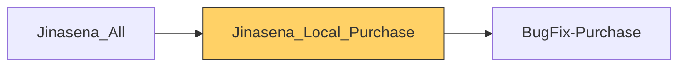

# Functional Documentation — Jinasena_Local_Purchase

> Generated by `scripts/generate_functional_docs.py` from branch `Visual_Migration_02` (commit 2b5d682 2026-10-01) and the installed module on the clean environment. For every attribute: **Function** = what it does, **Depends on** = the attributes it relies on (owning module in brackets when it is not this repo), **Used by** = the attributes in any Jinasena repo that rely on it.

| Item | Value |
|---|---|
| Technical name | `Jinasena_Local_Purchase` |
| Title | Jinasena : SubModule : Purchase : Local Purchase |
| Version | `17.0.1.0.2` |
| Category | Purchases |
| License | LGPL-3 |
| Installed on environment | installed 17.0.1.0.2 |
| History | [CHANGELOG.md](CHANGELOG.md) |

## Purpose

<!-- SUMMARY:repo -->
A small fix module for the **Local Purchase (Credit)** workflow. It makes the **Confirm Order** button on purchase orders appear at the right time.

BugFix-Purchase already runs the "Update PR" step automatically when an order is confirmed. However, the button rule inherited from the old Studio form still waited for that step (`x_studio_pr_update` and `x_studio_receive_status == 'Pending'`), so Confirm never showed. This module replaces the rule. Confirm Order is now visible once the RFQ has been **sent**, unless:
- the order comes from a sales-order PR,
- header charges are still to be created or allocated, or
- a subcontracting PR is waiting on its sales order or has no specifications.
<!-- /SUMMARY -->

## Module dependencies

| Kind | Modules |
|---|---|
| Odoo standard / enterprise | `base_setup`, `purchase` |
| Jinasena repos | `BugFix-Purchase` |
| Third-party apps |  |
| Used by (Jinasena repos that depend on this one) | `Jinasena_All` |

## Contents at a glance

| Attribute type | Count |
|---|---|
| Models extended | 1 |
| Views | 1 |

## Models

| Model | Description | Created / extends | Fields | Views | Actions + automations | Approvals |
|---|---|---|---|---|---|---|
| `purchase.order` | Purchase Order | extends (purchase) | 0 | 1 | 0 | 0 |

### `purchase.order` — Purchase Order

*Extends a model created by `purchase`.*

Other repos that use this model: `access right BugFix-Purchase.access_6249_inv___administrator` (BugFix-Purchase) `access right BugFix-Purchase.access_6376_purchase_order` (BugFix-Purchase) `access right BugFix-Purchase.access_6377_purchase_order` (BugFix-Purchase) `access right BugFix-Purchase.access_6870_purchase_order` (BugFix-Purchase) `account.bank.statement.line.x_studio_many2one_field_XhwuI` (BugFix-Accounting) `account.bank.statement.line.x_studio_purchase_id` (BugFix-Accounting) `account.move.x_studio_purchase_id` (BugFix-Accounting) `account.payment.x_studio_many2one_field_XhwuI` (BugFix-Accounting)

+110 more
`account.payment.x_studio_purchase_id` (BugFix-Accounting) `account.payment.x_studio_purchase_order` (BugFix-Accounting) `approval rule BugFix-Approvals.rule_11_purchase_order_confirm_reminder_mail_user_types_internal_use` (BugFix-Approvals) `approval rule BugFix-Approvals.rule_12_purchase_order_button_confirm_user_types_public_12` (BugFix-Approvals) `approval rule BugFix-Approvals.rule_13_purchase_order_button_confirm_po_approval_10_000_amount_13` (BugFix-Approvals) `approval rule BugFix-Approvals.rule_14_purchase_order_confirm_reminder_mail_user_types_internal_use` (BugFix-Approvals) `approval rule BugFix-Approvals.rule_15_purchase_order_button_confirm_user_types_internal_user_15` (BugFix-Approvals) `approval rule BugFix-Approvals.rule_16_purchase_order_button_confirm_po_approval_10_000_amount_16` (BugFix-Approvals) `approval rule BugFix-Approvals.rule_17_purchase_order_button_confirm_po_approving_users_17` (BugFix-Approvals) `approval rule BugFix-Approvals.rule_48_purchase_order_button_approve_po_approvals_po_amount_500_000` (BugFix-Approvals) `approval rule BugFix-Approvals.rule_49_purchase_order_button_approve_po_approval_po_amount_500_000_` (BugFix-Approvals) `approval rule BugFix-Approvals.rule_52_purchase_order_button_confirm_user_types_internal_user_52` (BugFix-Approvals) `approval rule BugFix-Approvals.rule_53_purchase_order_button_confirm_user_types_internal_user_53` (BugFix-Approvals) `approval rule BugFix-Approvals.rule_54_purchase_order_button_confirm_po_approval_po_amount_500_000_` (BugFix-Approvals) `approval rule BugFix-Approvals.rule_64_purchase_order_button_cancel_user_types_internal_user_64` (BugFix-Approvals) `approval rule BugFix-Approvals.rule_67_purchase_order_button_approve_purchase_user_67` (BugFix-Approvals) `approval rule BugFix-Approvals.rule_68_purchase_order_button_approve_user_types_internal_user_68` (BugFix-Approvals) `approval rule BugFix-Approvals.rule_69_purchase_order_button_approve_user_types_internal_user_69` (BugFix-Approvals) `approval rule BugFix-Approvals.rule_70_purchase_order_button_approve_technical_jin_po_creator_70` (BugFix-Approvals) `approval rule BugFix-Approvals.rule_71_purchase_order_button_approve_user_types_internal_user_71` (BugFix-Approvals) `approval rule BugFix-Approvals.rule_72_purchase_order_button_approve_technical_jin_po_creator_72` (BugFix-Approvals) `approval rule BugFix-Approvals.rule_73_purchase_order_button_approve_user_types_internal_user_73` (BugFix-Approvals) `approval rule BugFix-Approvals.rule_74_purchase_order_button_approve_po_approval_po_amount_500_000_` (BugFix-Approvals) `approval rule BugFix-Approvals.rule_75_purchase_order_button_approve_po_approval_po_amount_500_000_` (BugFix-Approvals) `approval rule BugFix-Approvals.rule_7_purchase_order_button_confirm_purchase_administrator_7` (BugFix-Approvals) `approval rule BugFix-Approvals.rule_87_purchase_order_button_cancel_administration_access_rights_87` (BugFix-Approvals) `approval rule BugFix-Approvals.rule_88_purchase_order_button_approve_sales_jin_credit_note_approver` (BugFix-Approvals) `approval rule BugFix-Approvals.rule_89_purchase_order_button_confirm_purchase_jin_po_approvers_po_a` (BugFix-Approvals) `approval rule BugFix-Approvals.rule_90_purchase_order_button_confirm_purchase_jin_po_approvers_po_a` (BugFix-Approvals) `approval rule BugFix-Approvals.rule_98_purchase_order_button_approve_purchase_jin_po_approvers_po_a` (BugFix-Approvals) `automation BugFix-Purchase.base_automation_112_imp_validate_negative_qtys` (BugFix-Purchase) `automation BugFix-Purchase.base_automation_18_restrict_delete_in_po` (BugFix-Purchase) `automation BugFix-Purchase.base_automation_192_update_pr_type_parameters` (BugFix-Purchase) `automation BugFix-Purchase.base_automation_232_update_analytic_tag_order_vendor` (BugFix-Purchase) `automation BugFix-Purchase.base_automation_233_update_analytic_tag_order_user` (BugFix-Purchase) `automation BugFix-Purchase.base_automation_87_imp_update_cost_allocation` (BugFix-Purchase) `mail template BugFix-Purchase.mail_template_51_purchase_order_jinasena_pvt_ltd_order_ref_po_01296` (BugFix-Purchase) `mail template BugFix-Purchase.mail_template_52_purchase_order_jinasena_pvt_ltd_order_ref_po_01320` (BugFix-Purchase) `mail template BugFix-Purchase.mail_template_53_purchase_order_jinasena_pvt_ltd_order_ref_po_01320` (BugFix-Purchase) `mail template BugFix-Purchase.mail_template_54_purchase_order_send_rfq_test` (BugFix-Purchase) `mail template BugFix-Purchase.mail_template_57_purchase_order_jinasena_pvt_ltd_order_ref_po_01326` (BugFix-Purchase) `mail template BugFix-Purchase.mail_template_58_purchase_order_send_rfq_test_copy_1` (BugFix-Purchase) `purchase.order.x_studio_purchase_order_deliver_remainder` (BugFix-Purchase) `record rule BugFix-Purchase.rule_138_purchase_order_multi_company` (BugFix-Purchase) `record rule BugFix-Purchase.rule_140_portal_purchase_orders` (BugFix-Purchase) `report BugFix-Studio-Misc.action_report_1597_purchase_order_list` (BugFix-Studio-Misc) `report BugFix-Studio-Misc.action_report_1634_indent_cost_estimation_working_backup` (BugFix-Studio-Misc) `report BugFix-Studio-Misc.action_report_1635_indent_cost_estimation` (BugFix-Studio-Misc) `report BugFix-Studio-Misc.action_report_3437_c08_purchase_order` (BugFix-Studio-Misc) `report BugFix-Studio-Misc.action_report_3438_c07_request_for_quotation` (BugFix-Studio-Misc) `server action BugFix-Accounting.server_action_1368_imp_update_consignment_vendor_bill` (BugFix-Accounting) `server action BugFix-Accounting.server_action_1396_imp_update_consignment_vendor_bill` (BugFix-Accounting) `server action BugFix-Purchase.server_action_1007_append_pr_to_rfq` (BugFix-Purchase) `server action BugFix-Purchase.server_action_1010_append_multiple_pr_to_rfq` (BugFix-Purchase) `server action BugFix-Purchase.server_action_1209_imp_create_header_charges` (BugFix-Purchase) `server action BugFix-Purchase.server_action_1212_imp_allocate_header_charges` (BugFix-Purchase) `server action BugFix-Purchase.server_action_1389_imp_validate_payment_method` (BugFix-Purchase) `server action BugFix-Purchase.server_action_1400_imp_create_lc` (BugFix-Purchase) `server action BugFix-Purchase.server_action_1406_imp_change_payment_method_lc` (BugFix-Purchase) `server action BugFix-Purchase.server_action_1455_imp_update_cost_allocation_method_in_rfq` (BugFix-Purchase) `server action BugFix-Purchase.server_action_1698_imp_change_currency_rate` (BugFix-Purchase) `server action BugFix-Purchase.server_action_1699_imp_reset_header_charges` (BugFix-Purchase) `server action BugFix-Purchase.server_action_1700_imp_receive_quotation` (BugFix-Purchase) `server action BugFix-Purchase.server_action_1707_imp_track_unit_price_change_in_po_line` (BugFix-Purchase) `server action BugFix-Purchase.server_action_1708_imp_track_quantity_change_in_po_line` (BugFix-Purchase) `server action BugFix-Purchase.server_action_1712_imp_validate_negative_qtys_in_custom_exchange_rate` (BugFix-Purchase) `server action BugFix-Purchase.server_action_1717_update_actual_spent_in_cash_purchase` (BugFix-Purchase) `server action BugFix-Purchase.server_action_2133_update_pr_type_parameters_in_po` (BugFix-Purchase) `server action BugFix-Purchase.server_action_2254_proj_accept_specification_for_sub_contracting` (BugFix-Purchase) `server action BugFix-Purchase.server_action_2259_proj_send_specification_by_email` (BugFix-Purchase) `server action BugFix-Purchase.server_action_2287_send_specification_by_email_user_manual` (BugFix-Purchase) `server action BugFix-Purchase.server_action_2372_imp_rfq_reverse` (BugFix-Purchase) `server action BugFix-Purchase.server_action_2373_reverse_pr_status_in_po` (BugFix-Purchase) `server action BugFix-Purchase.server_action_2375_reverse_pr_status_in_po_2` (BugFix-Purchase) `server action BugFix-Purchase.server_action_2412_update_analytic_tag_parameters_purchase_order_vend` (BugFix-Purchase) `server action BugFix-Purchase.server_action_2413_update_analytic_tag_parameters_purchase_order_user` (BugFix-Purchase) `server action BugFix-Purchase.server_action_2423_purchase_order_deliver_remainder_cancel` (BugFix-Purchase) `server action BugFix-Purchase.server_action_830_copy_pr_to_rfq` (BugFix-Purchase) `server action BugFix-Purchase.server_action_877_copy_pr_to_rfq_temp_2` (BugFix-Purchase) `server action BugFix-Purchase.server_action_880_copy_multiple_pr_to_rfq` (BugFix-Purchase) `server action BugFix-Purchase.server_action_911_copy_cp_to_po` (BugFix-Purchase) `server action BugFix-Purchase.server_action_917_cash_purchase_cash_settled` (BugFix-Purchase) `server action BugFix-Purchase.server_action_991_update_pr_status_in_po` (BugFix-Purchase) `server action BugFix-Purchase.server_action_994_restrict_delete_in_po_based_on_linked_pr` (BugFix-Purchase) `window action BugFix-Purchase.act_window_2238_subcontracting_pos` (BugFix-Purchase) `window action BugFix-Purchase.act_window_832_related_rfq` (BugFix-Purchase) `window action BugFix-Purchase.act_window_912_related_po` (BugFix-Purchase) `window action BugFix-Purchase.action_2238_subcontracting_pos` (BugFix-Purchase) `window action BugFix-Purchase.action_3648_related_po` (BugFix-Purchase) `window action BugFix-Purchase.action_3650_related_rfq` (BugFix-Purchase) `window action BugFix-Purchase.action_832_related_rfq` (BugFix-Purchase) `window action BugFix-Purchase.action_912_related_po` (BugFix-Purchase) `window action BugFix-Purchase.action_related_po_read_only` (BugFix-Purchase) `window action BugFix-Purchase.action_related_rfq_read_only` (BugFix-Purchase) `window action BugFix-Purchase.aw_f4_purchase_order_related_po` (BugFix-Purchase) `window action BugFix-Purchase.aw_f4_purchase_order_related_rfq` (BugFix-Purchase) `window action BugFix-Purchase.aw_f4_purchase_order_subcontracting_pos` (BugFix-Purchase) `x_consignment_line.x_studio_purchase_id` (BugFix-Stock) `x_import_rfq_charge_he.x_studio_rfq_id` (BugFix-Purchase) `x_import_rfq_charge_li.x_studio_indent` (BugFix-Purchase) `x_import_rfq_charge_li.x_studio_rfq_id` (BugFix-Purchase) `x_lc_header.x_studio_created_from_purchase_order` (BugFix-Accounting) `x_pr_line_cash.x_studio_ref_po` (BugFix-Purchase) `x_purchase.request.line.make.purchase.order.x_purchase_order_id_2` (BugFix-Purchase) `x_purchase.request.line.make.purchase.order.x_purchase_order_id` (BugFix-Purchase) `x_purchase_request._compute_related_purchase_order_count()` (BugFix-Purchase) `x_purchase_request_cas._compute_related_purchase_order_count()` (BugFix-Purchase) `x_purchase_request_lin.x_studio_last_po` (BugFix-Purchase) `x_purchase_request_lin.x_studio_ref_po` (BugFix-Purchase) `x_temp_consignment_lin.x_studio_purchase_id` (BugFix-Stock)

**Summary:**

<!-- SUMMARY:model:purchase.order -->
Only changes the purchase order form: it rewrites when the **Confirm Order** button (`button_confirm`) is visible (see the view below). No fields or logic are added.
<!-- /SUMMARY -->

**Views (1):**

| Name | Record name | Type | What it changes | Function | Depends on | Used by |
|---|---|---|---|---|---|---|
| jinasena_local_purchase.po.form.show.confirm | `jlp_view_po_form_show_confirm` | form | set invisible=state != 'sent' or x_studio_so_pr or x_studio_create_header_charges or x_studio_allocate_header_charges or (x_studio_subcontracting_pr and x_studio_subcontracting_so_status_1 not in ('sale', 'done')) or (x_studio_subcontracting_pr and not x_studio_specifications) on `//header/button[@name='button_confirm']` | On the Purchase Order form, shows the Confirm Order button only when the RFQ is in Sent state and it is not an SO-PR, not flagged for header-charge creation/allocation, and (for subcontracting PRs) the linked SO is confirmed/done and Specifications are filled. | `view purchase.purchase_order_form` (purchase) |  |

## Depends on other modules' attributes

Everything of other modules that this repo's attributes rely on. If one of these is removed or changed, this repo is affected.

| Module | Kind | Count | Attributes |
|---|---|---|---|
| `purchase` | Odoo | 2 | model purchase.order, view purchase.purchase_order_form |

## Used by other repos

This repo's attributes that other Jinasena repos rely on. Changing or removing one of these affects that repo.

_None._
